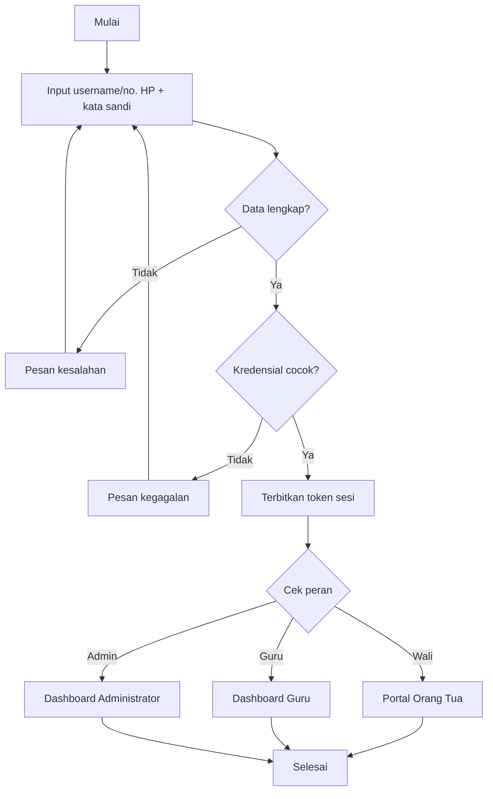
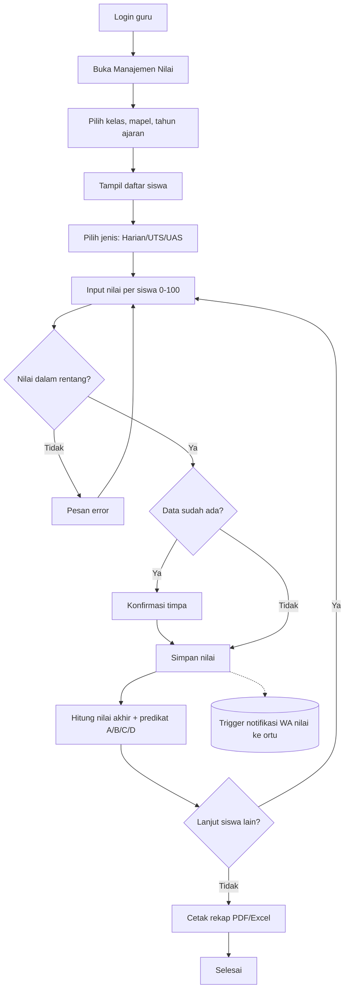
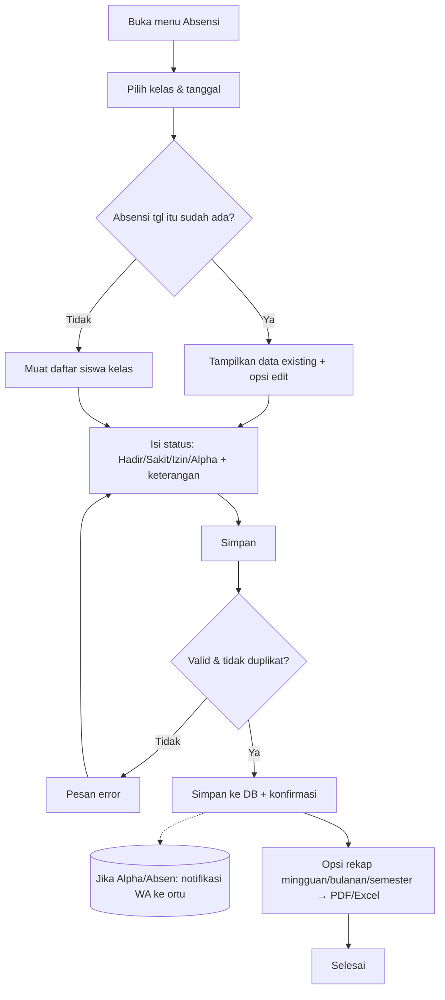
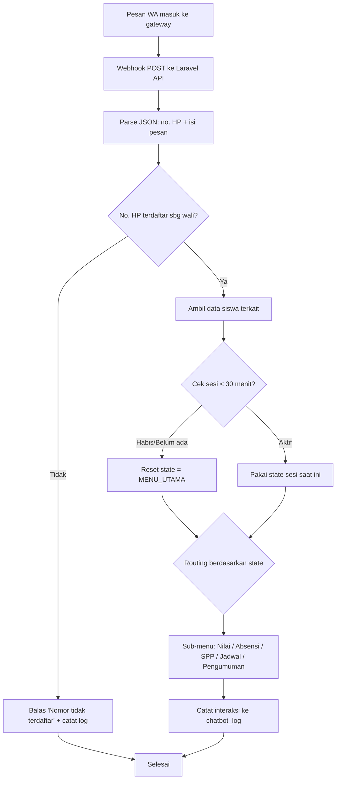
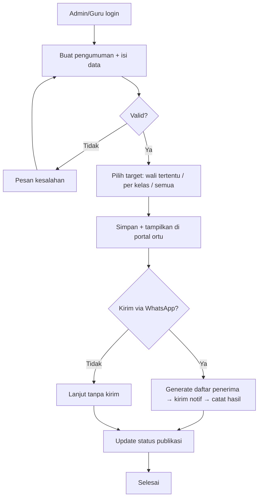
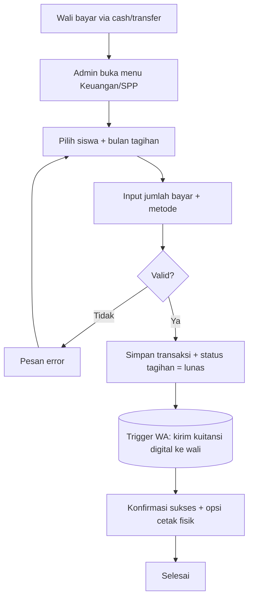

# 03 — Alur Sistem (DFD & Flowchart)

> Transkripsi lengkap DFD Level 0/1/2 (Gambar 3.9–3.14) dan flowchart proses (Gambar 3.2–3.8)
> dari BAB III `KREKSEK_FIXED.docx`. Ini adalah spesifikasi alur data yang harus diimplementasikan.

---

## 1. Entitas & Data Store

**Entitas eksternal:**
| Kode | Entitas |
|------|---------|
| E1 | Admin |
| E2 | Guru |
| E3 | Siswa (penerima layanan; tidak login pada scope ini) |
| E4 | Orang Tua/Wali |
| E5 | WhatsApp Gateway |

**Data store:**
| Kode | Store | Tabel terkait |
|------|-------|---------------|
| D1 | Data Master | users, siswa, guru, wali, kelas, mata_pelajaran, jadwal, tagihan_spp, pengumuman |
| D2 | Data Nilai & Absensi | nilai, absensi |
| D3 | Data Pesan | chatbot_sessions, chatbot_logs, notifikasi_whatsapp |
| D4 | Data Laporan | (hasil generate laporan/rekap; dapat berupa view/cache) |

---

## 2. DFD Level 0 (Diagram Konteks) — Gambar 3.9

Batas sistem secara keseluruhan; 5 entitas eksternal berinteraksi dengan **satu proses tunggal**
(Sistem Informasi Akademik). Tidak merinci proses internal.

```
E1 Admin ─── data master, pengguna, SPP, pengumuman ──▶ ┌─────────────────┐
         ◀── dashboard, laporan, konfirmasi ─────────── │                 │
E2 Guru  ─── nilai, absensi harian ──────────────────▶ │     SIAKAD      │
         ◀── rekap, laporan ─────────────────────────── │  Nurul Jadid    │
E4 Ortu  ─── query info anak (via WA) ───────────────▶ │    Karduluk     │
         ◀── info akademik anak ──────────────────────  │                 │
E5 WA GW ─── pesan masuk + nomor HP ─────────────────▶ │                 │
         ◀── pesan balasan otomatis ─────────────────── └─────────────────┘
```

---

## 3. DFD Level 1 — Gambar 3.10

Empat proses utama:

```
                    ┌──────────────────────┐
E1 Admin ─────────▶ │ 1.1 Kelola Data      │◀──▶ D1 Data Master
   data master,     │     Master           │
   pengguna, SPP,   └──────────┬───────────┘
   pengumuman                  │ (acuan data master)
                               ▼
E2 Guru ──────────▶ ┌──────────────────────┐◀──▶ D2 Data Nilai & Absensi
   nilai, absensi   │ 1.2 Kelola Nilai &   │
                    │     Absensi          │
                    └──────────┬───────────┘
                               ▼
E5 WA GW ◀────────▶ ┌──────────────────────┐◀──▶ D3 Data Pesan
   pesan masuk/     │ 1.3 Kelola Pesan     │◀──▶ D2 (data akademik u/ balasan)
   balasan otomatis │     WhatsApp         │
                    └──────────┬───────────┘
                               ▼
E1 Admin ◀────────▶ ┌──────────────────────┐◀──▶ D1, D2, D4
   dashboard,       │ 1.4 Penyajian        │
   laporan,         │  Dashboard & Laporan │──▶ D4 (sumber jawaban query ortu)
   konfirmasi       └──────────────────────┘
E4 Ortu ◀── info akademik anak (via WA melalui 1.3) ──
```

---

## 4. DFD Level 2

### 4.1 Proses 1.1 — Kelola Data Master (Gambar 3.11)
Aktor **Admin (E1)**, store **D1**. Setiap sub-proses menerima operasi *tambah/ubah/hapus*,
menulis & membaca D1, lalu mengembalikan konfirmasi.

| Sub-proses | Fungsi | Data |
|-----------|--------|------|
| 1.1.1 | Kelola Data Siswa | data siswa |
| 1.1.2 | Kelola Data Guru | data guru |
| 1.1.3 | Kelola Data Pengguna | akun admin, akun login, hak akses |
| 1.1.4 | Kelola Data SPP | nominal, tahun ajaran, status pembayaran |
| 1.1.5 | Kelola Pengumuman | data pengumuman |

### 4.2 Proses 1.2 — Kelola Nilai & Absensi (Gambar 3.12)
Aktor **Guru (E2)**, store **D2**.

| Sub-proses | Fungsi | Data |
|-----------|--------|------|
| 1.2.1 | Input Nilai | simpan/update nilai siswa → D2 |
| 1.2.2 | Input Absensi Harian | simpan/update absensi → D2 |
| 1.2.3 | Rekap Nilai | baca D2; filter kelas, periode, mapel |
| 1.2.4 | Rekap Absensi | baca D2; filter kelas, periode |
| 1.2.5 | Generate Laporan Akademik | baca D2; filter periode, kelas, siswa |

### 4.3 Proses 1.3 — Kelola Pesan WhatsApp / Chatbot (Gambar 3.13)
Aktor **WA Gateway (E5)**, store **D3** & **D2**.

| Sub-proses | Fungsi |
|-----------|--------|
| 1.3.1 | Terima Pesan Masuk (nomor HP + isi) → simpan log ke D3 |
| 1.3.2 | Validasi Nomor Orang Tua → cek di D3*, update status validasi |
| 1.3.3 | Ambil Data Akademik dari D2 berdasarkan nomor valid |
| 1.3.4 | Susun Balasan Otomatis (query + data akademik) → simpan log ke D3 |
| 1.3.5 | Kirim Balasan ke WA Gateway → update status "terkirim" di D3 |

> *Catatan implementasi:* validasi nomor sebaiknya dicocokkan ke **`wali.no_wa` (D1)**, bukan hanya
> log pesan D3. Lihat `08-catatan-konsistensi.md` butir 3.

### 4.4 Proses 1.4 — Penyajian Dashboard & Laporan (Gambar 3.14)
Aktor **Admin (E1)**, store **D1, D2, D4**.

| Sub-proses | Fungsi |
|-----------|--------|
| 1.4.1 | Ambil Data Master (siswa, guru, pengguna, SPP, pengumuman) dari D1 |
| 1.4.2 | Ambil Data Nilai & Absensi dari D2 (filter kelas, periode, mapel, siswa) |
| 1.4.3 | Generate Dashboard → data dashboard untuk Admin |
| 1.4.4 | Generate Laporan (periode, kelas, siswa, jenis) → simpan/baca D4 |
| 1.4.5 | Tampilkan Dashboard/Laporan → tampilan ke Admin |

---

## 5. Flowchart Proses Kunci

### 5.1 Login & Autentikasi (Gambar 3.2)


> Tambahan flowchart: sistem juga mengecek `is_active`; akun nonaktif ditolak.

### 5.2 Input Nilai oleh Guru (Gambar 3.3)



### 5.3 Input Absensi oleh Guru (Gambar 3.4)



### 5.4 Alur Utama Chatbot WhatsApp (Gambar 3.5)
Detail lengkap di `05-chatbot-whatsapp.md`.



### 5.5 Pembuatan Pengumuman (Gambar 3.7)



### 5.6 Pencatatan Pembayaran SPP (Gambar 3.8)


> Catatan: portal orang tua juga menyediakan alur *self-service* konfirmasi pembayaran
> (unggah bukti transfer) → status `menunggu_verifikasi` → admin verifikasi (setujui/tolak).
